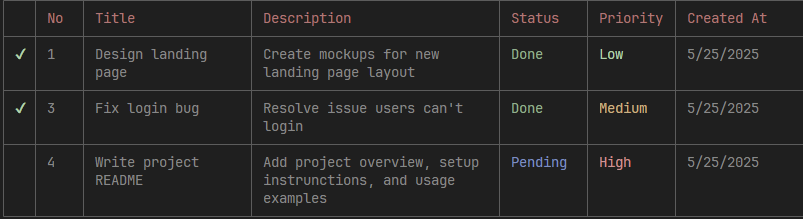

# TS To-Do CLI App

A command-line To-Do list application built in **TypeScript**.

---

## ✨ Features

✔️ Add new tasks with title, description, status, and priority.  
✔️ View tasks in a neatly formatted CLI table.  
✔️ Update task status (Todo, Pending, Done).  
✔️ Delete tasks by selecting the task number.  
✔️ Persistent storage using `tasks.json`.  
✔️ Colorful CLI output using **Chalk**.

---

## 📦 Libraries Used

- Inquirer (interactive CLI prompts)  
- Chalk (colorized CLI output)  
- CLI-Table3 (formatted CLI tables)  
- UUID (unique task IDs)  
- Date-fns (date formatting)

---

## 🚀 Installation

1️⃣ **Clone the repository**

```bash
git clone https://github.com/sadhilperera06/ts-todo-cli.git

cd ts-todo-cli
```
2️⃣ Install dependencies

```bash
npm install
```
3️⃣ Build the TypeScript project

```bash
npx tsc
```

4️⃣Run the app
```bash
node ./dist/index.js
```
---
## 🛠️ Usage
```bash
[1] Create Task
[2] View Tasks
[3] Update Task
[4] Delete Task
[5] Exit
```
- Create Task --> Add a new task.
- View Task --> See all tasks.
- Update Task --> Change the status of task.
- Delete Task --> Select a task by its number to dlt.
- Exit --> Quit the app.

## 📸 Demo



the app saves all tasks in a `data/tasks.json` file.

---

## 💻 Project Structure
```bash
src/
 ├── cli/Prompt.ts           # Handles CLI prompts and display
 ├── models/Todo.ts          # TypeScript interfaces and types
 ├── services/TaskService.ts # Core business logic (add, delete, update)
 ├── services/StorageService.ts # Read/write tasks to JSON
 └── index.ts                # Main application entry point
data/
 └── tasks.json              # Stores all tasks persistently
```

---
## 🤝 Contributing
Pull requests and contributions are welcome!
if you find a bug or want suggest an improvement, feel free to open an issue.

## 📄 License
MIT License - free to use, modify, and distribute.

## ✍️ Author  
Built by **S4dh1l**  
Follow me or check out more on [GitHub](https://github.com/sadhilperera06)


